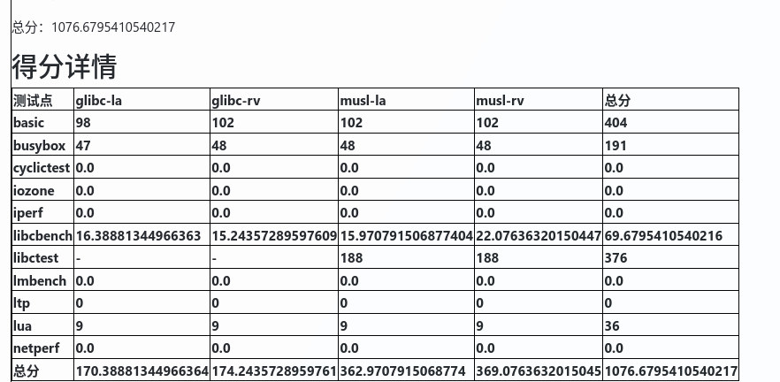
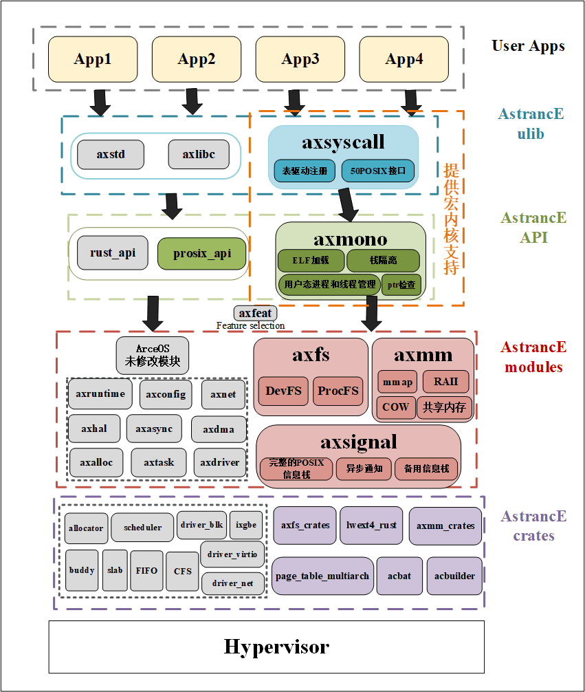

# AstrancE OS


## AstrancE OS 项目简介

---

AstrancE 是基于 ArceOS 使用 rust 开发的宏内核操作系统，具备良好的模块化设计与用户态支持能力。项目完成了从微内核向宏内核的架构转变，支持多线程、系统调用、VFS、信号机制、ELF 加载等核心功能，具备较强的可拓展性与移植性。

完成情况：
---

初赛情况
截至6月30日，AstrancE能在RISCV-64和LOONGARCH-64通过basic，busybox, libctest, libcbench和lua的绝大部分测例，在实时排名榜上位于14名,总分为1076.6795：
------

------

------
## 内核介绍
---

### ArceOS介绍

本项目基于 [ArceOS](https://github.com/arceos-org/arceos) 的内核框架进行扩展与增强开发。ArceOS 是一个采用 Rust 编写的模块化实验性操作系统，具有良好的组件化结构和跨平台支持，适合作为教学和研究的基础平台。然而，作为一个正在开发中的项目，ArceOS 在功能完备性、系统服务能力与用户态支持方面仍存在较多空白，AstrancE的目标就是进一步构建可用性强、接口健全的现代操作系统。

## AstrancE技术亮点：
- **系统调用机制重构**：从原有 minimal 实现过渡为支持完整接口集的宏内核结构，支持 POSIX 兼容调用与错误码体系。
- **内存子系统增强**：支持 `mmap` 映射、共享内存、`写时复制（COW` 机制，重构页表管理逻辑，增强用户态可用性与安全性。
- **文件系统拓展**：引入 `procfs`，支持动态构建虚拟节点，同时扩展设备挂载与设备文件支持（包括块设备）。
- **异步信号处理机制**：实现信号注册、排队、用户态处理等完整功能，符合 POSIX 标准。
- **用户态线程与并发支持**：支持 futex 等同步原语，实现线程级调度与切换。
- **构建与集成优化**：开发自动构建集成模块 `acbat`，支持组件裁剪、配置生成与构建流程简化。

## `AstrancE`与 `ArceOS` 的功能对比

| 功能模块   | AstrancE OS                                            | ArceOS                 | 差异说明                             |
| ---------- | ------------------------------------------------------ | ---------------------- | ------------------------------------ |
| 进程调度   | 支持`用户态进程`与`线程管理`                               | 支持内核线程调度       | 实现用户线程生命周期控制             |
| 文件系统   | VFS 框架、支持 **`procfs`** 与 **`devfs`**             | 原生多文件系统接口     | 实现统一接口、动态挂载机制           |
| 虚拟内存   | **`mmap`** /**`COW`** /**`共享内存`** /**`RAII 管理`** | 支持基本页表管理       | 安全封装与内存区生命周期自动控制     |
| 信号处理   | **`完整 POSIX 信号栈`**                                | 简化信号机制           | 支持异步通知、默认处理器与备用信号栈 |
| 系统调用   | **`表驱动注册`** + 50POSIX 接口                        | 静态匹配/手动注册      | 结构清晰，支持自动化生成与维护       |
| 用户态支持 | `ELF 加载`、`栈隔离`、Rust+C 运行时                    | 限制性支持部分用户程序 | 完整支持用户态进程运行与隔离机制     |
| 构建系统   | `支持 acbat 批量构建与嵌入式链接`                      | 常规构建流程           | 更适配批量用户程序构建与调试流程     |

------

## AstrancE OS 架构图

<p align="center">
  <br>
  <strong>图 1：AstrancE 系统架构图</strong>
</p>


## AstrancE OS 的模块化与多语言支持

AstrancE 支持 C / Rust 两种开发语言，兼容 POSIX API，主流程序可无缝移植。
通过 feature flags 实现灵活的功能裁剪，便于模块化扩展与按需构建。

```toml
[features]
smp = ["axfeat/smp"]
irq = ["axfeat/irq"]
alloc = ["dep:axalloc", "axfeat/alloc"]
multitask = ["axtask/multitask", "axfeat/multitask", "axsync/multitask"]
fd = ["alloc", "dep:axns"]
fs = ["dep:axfs", "dep:axfs_vfs", "axfeat/fs", "fd"]
net = ["dep:axnet", "axfeat/net", "fd"]
pipe = ["fd"]
select = ["fd"]
epoll = ["fd"]
uspace = ["axns/thread-local"]
```

通过 feature flags 灵活裁剪功能，AstrancE 可适配不同场景的系统功能需求。

### 工作量统计（按成员划分）

| 成员         | 提交次数   | 修改文件数     | 新增代码行数  | 删除代码行数  | 净增代码行数  |
| ------------ | ---------- | -------------- | ------------- | ------------- | ------------- |
| **曾熙晨**   | **99** 次  | **850** 个文件 | **19,841** 行 | **9,972** 行  | **9,869** 行  |
| **杨纯懿** | **17** 次  | **75** 个文件  | **830** 行    | **365** 行    | **465** 行    |
| **滕奇勋** | **5** 次   | **39** 个文件  | **2,678** 行  | **605** 行    | **2,073** 行  |
| **合计**     | **121** 次 | **964** 个文件 | **23,349** 行 | **10,942** 行 | **12,407** 行 |

## 工作总结

- 模块化设计：Feature Flags + 条件编译，子系统灵活裁剪

- 系统调用支持：实现 axsyscall，支持 50+ POSIX 调用

- 用户态兼容：axmono 支持 ELF 加载、进程/线程管理

- 虚拟内存管理：支持 mmap、COW、共享内存、安全隔离

- 内存安全：RAII + 所有权模型，自动资源管理

- 文件系统：VFS 支持多种 FS，动态挂载、路径匹配

- 设备管理：devfs 动态注册，procfs 内核信息导出

- 信号机制：POSIX 兼容，注册/屏蔽/触发/备用栈

- 异步事件：信号与调度器集成，支持异步响应

- 语言与生态：兼容 C/Rust，接口符合 POSIX/Linux 标准

------

##  AstrancE OS 项目结构

```
AstrancE_OS/                          # 项目根目录
├── api/                             # 提供给用户程序/外部模块的 API 接口定义
│   ├── arceos_api/                  # 与 ArceOS 兼容的接口层，便于迁移/对比
│   ├── arceos_posix_api/            # POSIX 风格的 API 封装，提升用户程序可移植性
│   └── axfeat/                      # 提供系统特性功能探测与声明（如 feature 宏）
├── configs/                         # 系统构建配置（目标平台、默认参数等）
├── crates/                          # 自定义工具库或构建工具集合
│   ├── acbat/                       # 自定义构建辅助工具（如打包、签名）
│   ├── acbuilder/                   # 构建镜像/ISO 的工具 crate
│   ├── axmm_crates/                 # 内存管理相关的扩展 crate
│   └── page_table_multiarch/        # 多架构页表支持模块
├── modules/                         # 核心模块源代码
│   ├── axalloc/                     # 内存分配器模块
│   ├── axconfig/                    # 配置项管理模块
│   ├── axdisplay/                   # 图形/显示设备支持模块
│   ├── axdma/                       # DMA 传输支持模块
│   ├── axdriver/                    # 设备驱动模块集合
│   ├── axfs/                        # 文件系统接口与实现
│   ├── axhal/                       # 硬件抽象层，适配多种平台
│   ├── axlog/                       # 日志系统
│   ├── axmm/                        # 内存管理模块（虚拟内存等）
│   ├── axnet/                       # 网络协议栈支持
│   ├── axns/                        # 命名空间实现（资源隔离）
│   ├── axruntime/                   # 系统运行时初始化与支持
│   ├── axsync/                      # 同步机制（锁/信号量等）
│   ├── axsyscall/                   # 系统调用处理与注册
│   └── axtask/                      # 任务与线程管理模块
├── README.md                        # 项目总览说明文件
├── rust-toolchain.toml             # 指定使用的 Rust 工具链版本
├── scripts/                         # 辅助脚本
│   ├── make/                        # 构建辅助脚本集合
│   └── net/                         # 网络配置/测试脚本
├── testcases/                       # 测试用例目录
│   └── nimbos/                      # 相关测试集/子系统测试
├── tools/                           # 各平台或调试用工具集合
│   ├── bsta1000b/                   # 特定 SoC 平台支持工具
│   ├── bwbench_client/              # 网络/带宽测试工具
│   ├── deptool/                     # 依赖检查与图生成工具
│   ├── phytium_pi/                  # Phytium 平台辅助工具
│   └── raspi4/                      # 树莓派 4 专用工具
├── ulib/                            # 用户态库（用户程序运行所需）
│   ├── axlibc/                      # C 标准库实现（或封装）
│   ├── axmono/                      # Mono运行库（可能是运行时支持库）
│   └── axstd/                       # Rust 风格的标准库封装
├── Cargo.lock                       # Rust 自动生成的依赖锁文件
├── Cargo.toml                       # 项目的主配置文件，定义依赖与元数据
├── doc/                             # 项目文档与平台说明
├── Dockerfile                       # 构建 Docker 环境所需的配置
├── examples/                        # 示例用户程序（Rust / C）
├── LICENSE.Apache2                  # Apache 2.0 许可证
├── LICENSE.GPLv3                    # GPLv3 许可证
├── LICENSE.MulanPSL2                # 木兰宽松许可证第2版
├── LICENSE.MulanPubL2               # 木兰公共许可证第2版
└── Makefile                         # 顶层构建脚本，支持 make 编译流程

```

## AstrancE OS 构建与运行

###  构建依赖

- Rust（建议使用 nightly 版本）
- `cargo-binutils` 与 `llvm-tools-preview`
- QEMU（用于 RISC-V 模拟器）
- Make / Bash / Python（用于辅助构建脚本）

------

### 构建命令

#### 获取源码：

1. 从远程仓库拉取 AstrancE 源码：

```sh
make AX_SOURCE=git:http:#github.com/AstranciA/AstrancE.git AX_ROOT=.AstrancE fetch_ax
```

或从本地路径拉取：

```sh
make AX_SOURCE=file:/path/to/AstrancE/ AX_ROOT=.AstrancE fetch_ax
```

⚠️ 注意：本地路径后面需加上斜杠 `/`。

- `AX_SOURCE` 默认为 `git:http:#github.com/AstranciA/AstrancE.git`，即官方 AstrancE 仓库地址；
- `AX_ROOT` 默认为 `.AstrancE`，即源码下载与构建目录。

------

1. 构建测试用例：
   RISCV-64构建方式：

```sh
make ARCH=riscv64 AX_ROOT=.AstrancE testcase
```

LoongArch64构建方式：

```sh
make ARCH=loongarch64 AX_ROOT=.AstrancE testcase
```

可阅读 `Makefile` 获取更多细节。构建完成后，生成的二进制文件将自动打包至 `$(AX_ROOT)/disk.img` 中。

------

### 运行方式

RISCV-64运行方式：

```sh
make ARCH=riscv64 run
```

LoongArch64运行方式：

```sh
make ARCH=loongarch64 run
```

如需了解更多运行选项与说明，请参考 AstrancE 项目文档。

------

## 内容链接

- [初赛文档](AstrancE初赛文档.pdf)
- [初赛PPT](AstrancE初赛ppt.pdf)
- [初赛演示视频](https://pan.baidu.com/s/1yeaeVvRJ3UNQ1StyZO0rEA?pwd=fuec)

------

## 项目人员

哈尔滨工业大学(深圳)：

- 曾熙晨([zeexoc@outlook.com](mailto:zeexoc@outlook.com))：内存管理重构、线程支持、信号机制优化、构建工具
- 滕奇勋([3045859462@qq.com](mailto:3045859462@qq.com))：多模块合并与维护，参与系统调用调试
- 杨纯懿([y2695719556@outlook.com](mailto:y2695719556@outlook.com))：实现 futex 用户态同步、busybox 兼容支持，参与 Lua 支持与用户态运行时环境维护
- 指导老师：夏文，仇洁婷
- 项目建设仓库：[AstranciA](https://github.com/AstranciA)

------

## 参考与致谢总结
本项目在开发过程中充分参考并使用了多个开源社区项目的模块与工具，以下是详细说明：

### 使用模块及来源

| 模块路径                             | 功能简介          | 源项目/地址                                                  |
| ------------------------------------ | ----------------- | ------------------------------------------------------------ |
| `modules/axsyscall`                  | 系统调用机制      | 自主开发，部分参考 [starry-next](https://github.com/oscomp/starry-next) |
| `modules/axmm`、`crates/axmm_crates` | 内存管理框架      | 基于 [ArceOS](https://github.com/arceos-org/arceos) 修改     |
| `crates/axfs_crates`                 | 文件系统模块封装  | 同上                                                         |
| `crates/page_table_multiarch`        | 多架构页表支持    | 同上                                                         |
| `crates/lwext4_rust`                 | EXT4 文件系统适配 | 修改自外部社区代码，作者信息详见各 `Cargo.toml`              |
| `axconfig-gen`                       | 内核配置生成器    | [axconfig-gen](https://github.com/arceos-org/axconfig-gen)   |
  
其他依赖如 `bitflags`、`linkme`、`linux-raw-sys` 等请参见 `Cargo.toml`。
          
### 外部贡献者（不完全统计）

部分关键模块的原作者与维护者包括：

- Yuekai Jia
- YdrMaster
- Luoyuan Xiao
- aarkegz
- ChengXiang Qi
- Shiping Yuan
- Zhour Rui
- Dashuai Wu
- Andre Richter
- 以及其他在 `git log` 中出现的社区贡献者（如 Asakura Mizu、chyyuu、DeathWish5、Mivik、Qix、Su Mingxian、Tim-C1、Youjie Zheng 等）


### 协议与合规说明
本项目遵循 **GPL-3.0-or-later OR Apache-2.0 OR MulanPSL-2.0** 多重开源协议。
 如需商用或二次分发，请严格遵守相应协议要求，并保留原始 License 与作者信息。

### 特别致谢

感谢所有开源社区贡献者的无私奉献！
本项目的开发离不开社区的支持与协作。
感谢全国大学生计算机系统能力大赛组委会提供的支持，感谢哈尔滨工业大学(深圳)夏文、仇洁婷老师的指导，感谢往届学长的支持。